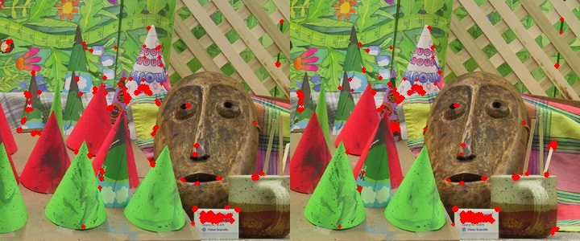
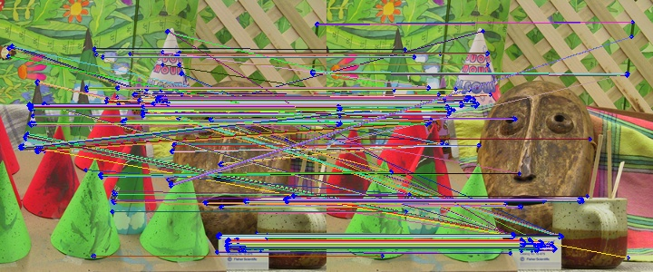
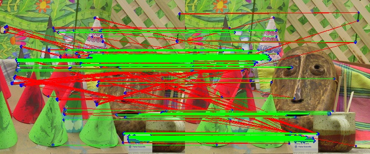

# Stereo
Compute a dense disparity map using the Fundamental matrix of 2 images.

# Progress of the project:
- [x] Compute the Harris corners of the images
- [x] Compute the correspondences between the images
- [ ] Compute the Fundamental matri using RANSAC
- [ ] Compute the disparity map using the Fundamental matrix


# How to use it:

## Install the dependencies:
```bash
pip install -r requirements.txt
```

## Run the code:
```bash
python3 stereo.py <left-image> <right-image>
```

# Output:

## Harris corners:


## Correspondences:




